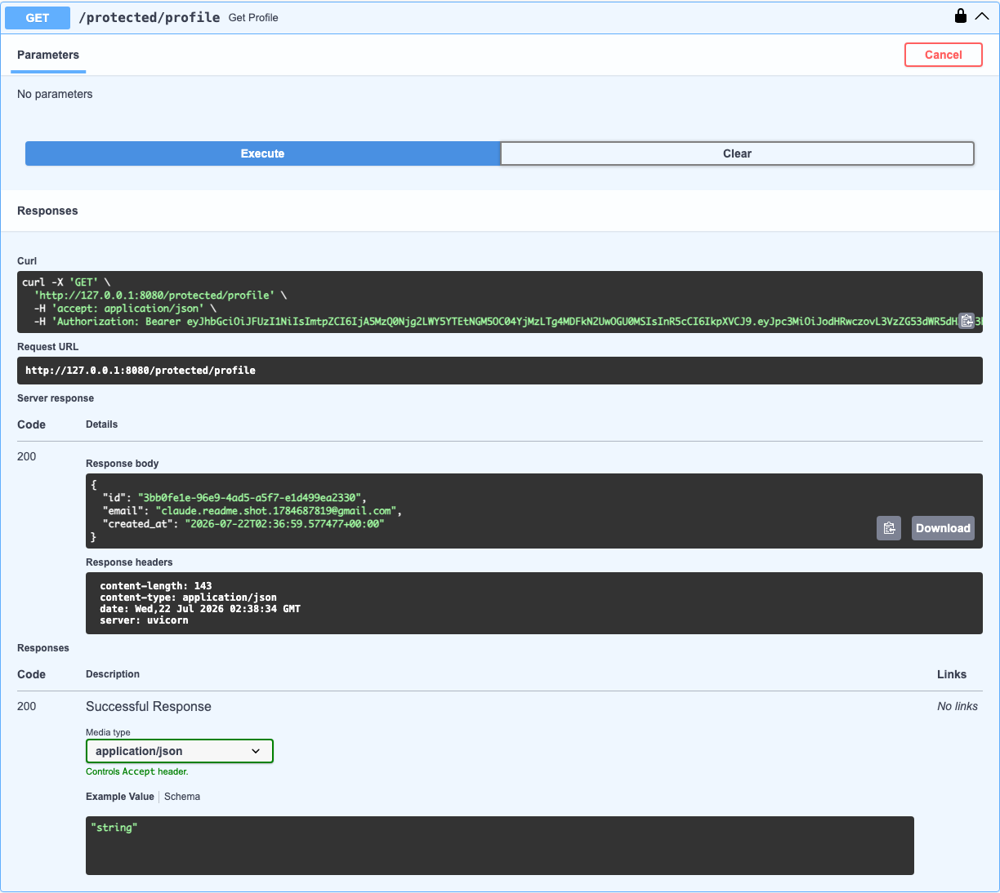

## W2 · A4 — Auth · Login & protect (Supabase)

### 1. What this is
A secured layer on top of the existing API using **Supabase Auth** as the Identity Provider: sign up, log in, log out, and two protected routes that only answer for a verified, logged-in user. No password hashing or JWT signing happens in this codebase — Supabase does that; this server only forwards credentials and verifies the tokens Supabase hands back.

### 2. Setup
1. Create a free project at [supabase.com](https://supabase.com) (or reuse one).
2. Under **Project Settings → API**, copy the **Project URL** and the **anon key** (never the `service_role` key).
3. Under **Authentication → Sign In / Providers → Email**, turn **Confirm email** off for local testing so a fresh signup can log in immediately.
4. Add to your `.env` (see `.env.example`):
   ```
   SUPABASE_URL=your_project_url
   SUPABASE_KEY=your_anon_key
   ```

### 3. Run it
```bash
python -m venv venv
source venv/bin/activate
pip install -r requirements.txt
uvicorn main:app --reload --port 8080
```
Interactive docs: `http://127.0.0.1:8080/docs`

### 4. Endpoints
| Method | Path | Auth | Behavior |
| --- | --- | --- | --- |
| `POST` | `/auth/signup` | none | Creates a Supabase user. `201` on success, `400` if `email`/`password` missing or rejected by Supabase. |
| `POST` | `/auth/login` | none | Returns an `access_token` + `refresh_token`. `400` missing input, `401` invalid credentials. |
| `POST` | `/auth/logout` | Bearer | Revokes the presented session. `204` on success, `401` if the token is missing/invalid. |
| `GET` | `/protected/profile` | Bearer | Returns the verified user's id/email/created_at. `401` if missing/invalid/expired token. |
| `GET` | `/protected/dashboard` | Bearer | Second route proving the same guard is reusable — no new auth code. |
| `GET` | `/public/info` | none | Open, unauthenticated endpoint. |

All errors are returned as `{"error": "..."}` with the matching status code (`400`/`401`).

### 5. How the guard works
`auth.py` defines `get_current_user`, a FastAPI dependency built on `fastapi.security.HTTPBearer`. It extracts the bearer token, calls `supabase.auth.get_user(token)` (a real network call to Supabase), and raises a custom `AuthError` — mapped to a clean `{"error": ...}` JSON body — on anything invalid. Every protected route just adds `Depends(get_current_user)`; `/protected/dashboard` was added with zero additional auth code to prove it.

### 6. Swagger bearer auth
`/docs` shows a lock icon on `/auth/logout`, `/protected/profile`, and `/protected/dashboard` (FastAPI derives this automatically from the `HTTPBearer` dependency). Click **Authorize**, paste an `access_token` from `/auth/login`, and **Try it out** on any protected route — no curl needed.



### 7. AI vs me (Stage 7 — the AI rematch)

I wrote a prompt from memory (without rereading this assignment doc) asking an AI to build the same secured API, generated the result into [`ai-version/`](ai-version/) on its own — separate from Stages 0–6 above — ran it against the same checkpoints, and compared it to what I built by hand.

**The prompt** ([`ai-version/PROMPT.md`](ai-version/PROMPT.md)):
> Build a FastAPI backend that uses Supabase for authentication. I need: `POST /auth/signup` (email/password → creates a Supabase user), `POST /auth/login` (returns the access token), `POST /auth/logout` (needs to be authenticated), `GET /protected/profile` (logged-in users only), `GET /public/info` (no auth). Use environment variables for the Supabase URL/key. Add a dependency/middleware that checks the Authorization header for a Bearer token and verifies it with Supabase before letting protected requests through. Make sure Swagger shows a lock icon and lets me authorize with a bearer token. Status codes: 201 signup, 200 login, 204 logout, 400 bad input, 401 missing/bad token.

**What I found, running it (not just reading it):**

1. **Token extraction** — it correctly used `fastapi.security.HTTPBearer`, so a missing/malformed header does land on `401` in this FastAPI version (I initially assumed it would 403 by default, based on older FastAPI behavior — checked the installed `0.139.0` source and it doesn't; worth verifying instead of assuming). What it *didn't* get right: the response body is `{"detail": "Not authenticated"}`, FastAPI's default shape — not the `{"error": ...}` shape my prompt asked for on every error, everywhere.
2. **A real security flaw in `/auth/logout`** — the AI called bare `supabase.auth.sign_out()`. That method signs out whatever session is cached on the *client instance*, not the token the caller presented. Since this server uses one shared global `Client` for all requests, I proved this with a two-user test: User A calls `/auth/logout` with their own token and gets `204`, but A's token is **still valid** afterward — meanwhile User B, who never logged out, gets **silently logged out instead**, because B's login was the last one to overwrite the shared client's cached session. My hand-built version avoids this entirely by calling `supabase.auth.admin.sign_out(token, "local")` with the caller's own token explicitly (still only the anon key — never `service_role`).
3. **What my prompt forgot to specify** — the exact `{"error": ...}` error shape, and that email/password presence has to be checked *before* Supabase is called. Without that, the AI reasonably used required (non-`Optional`) Pydantic fields, so a signup missing `password` returns FastAPI's automatic `422 Unprocessable Entity` instead of the `400` my prompt asked for — Pydantic validation runs before the route body ever executes. It also silently decided to return the *entire* raw Supabase user object on signup rather than a curated subset, and didn't add a second protected route to prove the guard is reusable, since I never asked for one.

**The rematch:** I rewrote the prompt ([`ai-version/PROMPT_V2.md`](ai-version/PROMPT_V2.md)) to pin down the `{"error": ...}` shape everywhere, require validating input before calling Supabase, spell out that logout must target the caller's *own* token on a stateless/concurrent server, and asked for a second protected route. Regenerated `ai-version/main.py` and re-ran everything: `400` with `{"error": ...}` on missing input, and the two-user logout test now passes cleanly (A's logout invalidates only A's token, B is untouched). **What changed in one sentence:** naming the exact failure modes I'd already seen (wrong error shape, wrong status code source, and the shared-client logout bug) turned three silent gaps into an explicit spec the second generation actually met.

---

## W3 · A1 — Tasks CRUD backed by SQLite

### 1. Why SQLite
SQLite requires no separate server or installation, stores the entire database in a single file, and is ideal for a small CRUD assignment where the goal is to demonstrate persistence, not to run a production-grade multi-user database. It ships with Python's standard library (`sqlite3`), so no extra service needs to run alongside the API.

### 2. Where the database file is stored
The database lives at `tasks.db` in the project root (see [tasks_db.py](tasks_db.py)). It is created automatically the first time the app starts — `init_tasks_db()` runs on FastAPI startup, creates the `tasks` table if it doesn't exist, and seeds three example tasks only if the table is empty. The file is git-ignored since it's local runtime state, not source code.

### 3. How to start the project
```bash
python -m venv venv
source venv/bin/activate
pip install -r requirements.txt
uvicorn main:app --reload --port 8080
```
`tasks.db` is created automatically on first run in the project root.

### 4. Endpoints
| Method | Path | Behavior |
| --- | --- | --- |
| `GET` | `/tasks` | Returns every task from SQLite |
| `GET` | `/tasks/{id}` | Returns one task, or `404 {"error": "Task not found"}` |
| `POST` | `/tasks` | Inserts a task; `400 {"error": "title is required"}` if `title` is missing |
| `PUT` | `/tasks/{id}` | Updates a task's `title`/`done`; `404` if not found |
| `DELETE` | `/tasks/{id}` | Deletes a task; `204` on success, `404` if not found |

### 5. Example SQL query executed against the database
```sql
SELECT * FROM tasks WHERE done = 1;
```
Opened `tasks.db` in DB Browser for SQLite, ran the query above to confirm completed tasks, then hit `GET /tasks?...` and manual edits in the viewer to verify the API reflects the underlying table immediately.

*(Add your DB Browser screenshot here: `docs/tasks-db-screenshot.png`)*

### 6. Persistence proof
1. `POST /tasks` a few tasks.
2. Restart the server (`Ctrl+C`, then `uvicorn main:app --reload --port 8080` again).
3. `GET /tasks` — the tasks are still there, and the three seed tasks are **not** duplicated.

---

## Assignment Solution: Docker & Postgres Integration

### 1. Architectural Integrity
As required by the assignment guidelines, the core service layer and API routes have remained completely untouched from Assignment 2. By leveraging structural layering, the underlying volatile in-memory storage repository was seamlessly swapped for a real PostgreSQL implementation by updating only the entry point connection logic.

### 2. Proof of Data Persistence
Persistence was manually tested and proven using Postman via the following flow:
1. Triggered a `POST` request to `http://localhost:8080/data` sending a JSON payload. The row was successfully written to the Postgres container.
2. Ran `docker compose down` to stop and remove all active app and database container layers.
3. Restarted the entire local stack in one command via `docker compose up`.
4. Triggered a `GET` request to `http://localhost:8080/data` in Postman. The previously stored record was successfully retrieved from the database, proving that the data persists across system restarts due to the configured Docker named volume.

---

## Week 4 Feature: AI API Integration (Structured Output & Telemetry)

### 1. Abstract Provider Seam
The integration isolates LLM interactions into an independent interface module (`ai_service.py`). The rest of the FastAPI application routes do not interact directly with the underlying SDK. By swapping the `AI_PROVIDER` flag inside the `.env` file, the underlying API engine can be globally targeted without changing any routing code, establishing an isolated architectural seam.

### 2. Schema-Validated JSON & Fault Tolerance
The `POST /classify` endpoint requests structured tracking data from the `gemini-flash-latest` model. The raw response is strictly parsed and validated against a Pydantic structure definition (`schemas.py`), ensuring that malformed formatting is gracefully handled rather than crashing the operational thread. Network safety protections include a timeout cap on outbound transactions along with localized retry routines designed to back off during brief 429/5xx anomalies while instantly blocking 400 client-side failures.

### 3. Telemetry & Cost Line Monitoring
Every transaction actively computes standard production pricing calculations mapped against input and output tokens. The terminal logs track the operations dynamically using the following structure:
`[AI LOG - Feature: Text Classification] Input Tokens: <count> | Output Tokens: <count> | Estimated Cost: $<calculated_amount>`


## Week 4: Asynchronous PDF Report Generator (Background Jobs)

### 1. Architectural Overview
To optimize API performance and prevent HTTP timeouts, the PDF reporting engine is decoupled into an asynchronous producer-consumer pattern using FastAPI's `BackgroundTasks`. 

* **Trigger (`POST /reports`)**: Inserts a tracking record with a `pending` status into PostgreSQL and immediately yields a response payload containing the unique `report_id` to the client.
* **Worker Execution**: Runs in a background thread executing data warehouse aggregations via `psycopg` on the active database storage engine.
* **Artifact Layout Engine**: Synthesizes and draws dynamic graphical components onto a local disk storage layer using `reportlab`.
* **Verification & Delivery (`GET /reports/{id}/download`)**: Streams the compiled structural PDF back to the system client using an optimized chunked `FileResponse`.

---

### 2. Verified Workflow Logs & Postman Execution

The end-to-end background lifecycle was verified locally via Postman across three phases:

#### Phase A: Job Dispatching
* **Endpoint**: `POST http://localhost:8080/reports`
* **Response Payload**:
    ```json
    {
        "message": "Report generation started in the background",
        "report_id": 2,
        "status_check_url": "http://localhost:8080/reports/2"
    }
    ```

#### Phase B: Asynchronous State Transitions (Polling)
* **Endpoint**: `GET http://localhost:8080/reports/2`
* **Response Payload (Processing / Complete)**:
    ```json
    {
        "report_id": 2,
        "status": "completed",
        "download_url": "http://localhost:8080/reports/2/download"
    }
    ```

#### Phase C: Local Storage & Binary Artifact Streaming
* **Endpoint**: `GET http://localhost:8080/reports/2/download`
* **Result**: Postman successfully captures the streamable header and opens a structural PDF canvas displaying automated database telemetry counts grouped by date/status. Wiping or restarting containers does not risk structural data state corruption as the output layer interacts cleanly via Docker storage rules.

---

## Week 5 Feature: Ethical Web Scraper & Background Data Pipeline

### 1. Pipeline Architecture
To prepare a high-quality corpus for downstream RAG integration, this service implements an ethical web scraping and parsing pipeline:
* **Fetch (`requests` / `httpx`)**: Retrieves targeted web pages asynchronously using descriptive user identification headers.
* **Parse (`BeautifulSoup4`)**: Parses HTML responses and extracts structured target attributes (e.g., page text, quotes, author metadata, tags).
* **Clean & Structure**: Sanitizes extracted text and maps raw records into schema-validated models.
* **Persist (`psycopg`)**: Inserts normalized records into PostgreSQL database tables with conflict handling to avoid duplicating target records.

### 2. Professionalism Layer & Ethical Bot Behavior
* **`robots.txt` Compliance**: Queries and parses target site directives prior to crawling to respect disallowed paths and crawl delays.
* **Rate-Limiting & Politeness**: Enforces interval delays between consecutive network calls to prevent overwhelming remote host bandwidth.
* **Identifiable User-Agent**: Transmits customized HTTP `User-Agent` identification headers identifying the bot and providing contact details for webmasters.

### 3. Execution Flow (`POST /scrape`)

#### Request Payload
* **Endpoint**: `POST http://localhost:8080/scrape`
* **Body**:
    ```json
    {
      "urls": [
        "[https://quotes.toscrape.com/page/1/](https://quotes.toscrape.com/page/1/)",
        "[https://quotes.toscrape.com/page/2/](https://quotes.toscrape.com/page/2/)"
      ]
    }
    ```

#### Response Payload
```json
{
  "status": "processing",
  "message": "Scraper has been spun up in the background for 2 targets."
}